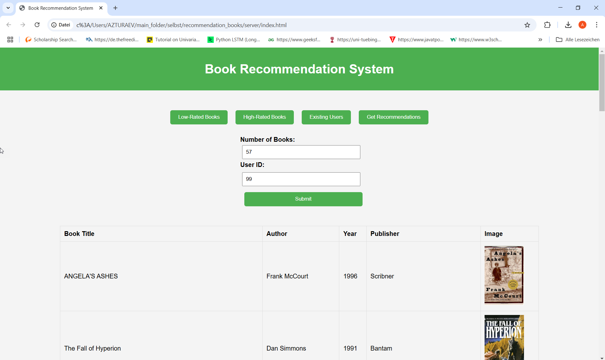
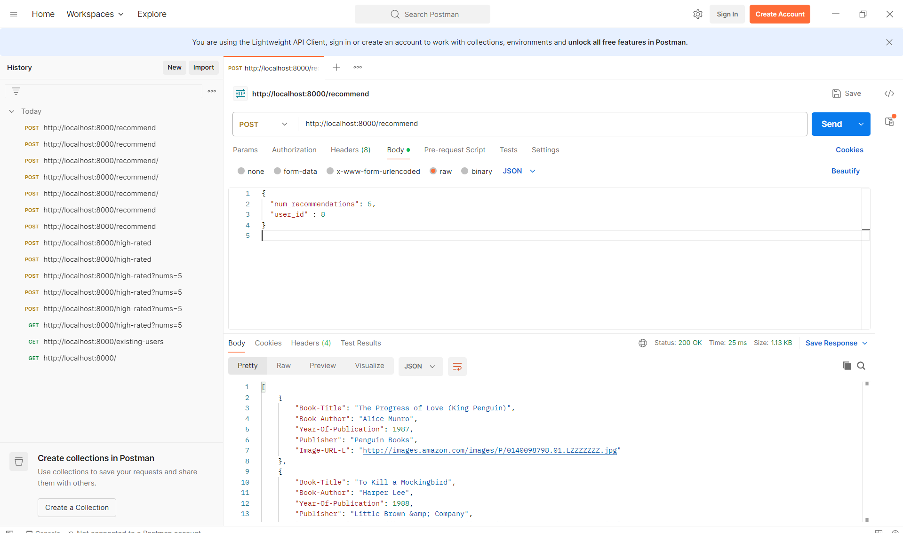
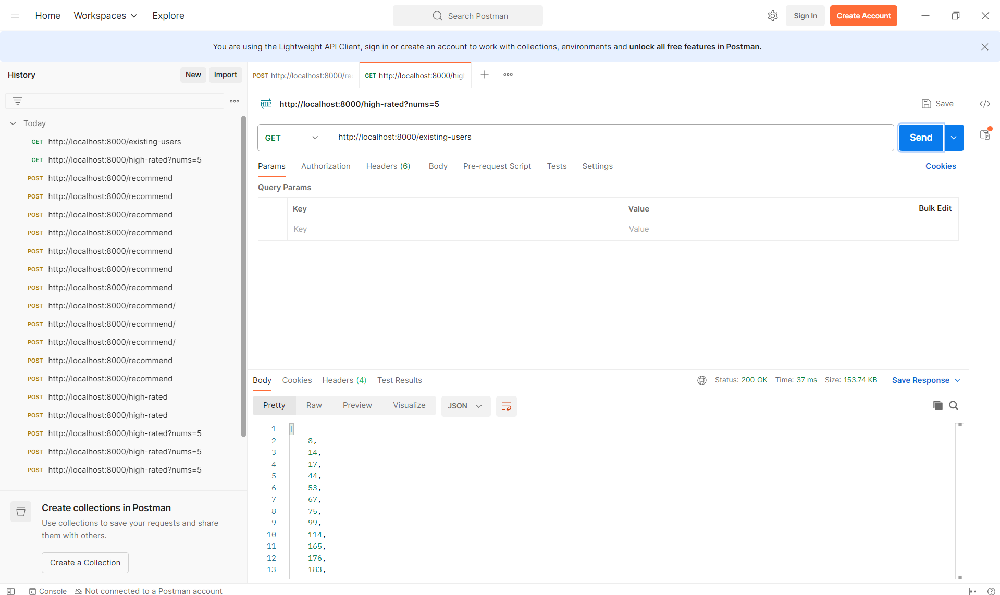

# Book Recommendation System

This project implements a book recommendation system using data from the [Book Recommendation Dataset on Kaggle](https://www.kaggle.com/datasets/arashnic/book-recommendation-dataset/data). The dataset contains three CSV files: `book.csv`, `ratings.csv`, and `user.csv`, which are used for generating book recommendations.

The system leverages cosine similarity to recommend books based on ratings and user preferences. It has both an API and a web interface for interacting with the recommendation system.

## Features
- **Data Cleaning & Processing**: Cleaned and preprocessed the dataset to ensure data quality.
- **Cosine Similarity**: Utilized cosine similarity to generate book recommendations.
- **FastAPI Deployment**: Deployed the recommendation system using FastAPI.
- **Docker Support**: Created a Dockerfile for easy deployment.
- **Web Interface**: Built a simple web interface with HTML and JavaScript for interaction.

## Requirements
To run the application locally, you’ll need:
- Python 3.x
- Docker (for running in a container)
- Uvicorn for FastAPI

## Running the Application

You can run the recommendation system either manually or by using Docker. Below are the instructions for both methods:

### Method 1: Run using Docker

1. **Build the Docker image**:

    ```bash
    docker build -t recommendation_books .
    ```

2. **Run the Docker container**:

    ```bash
    docker run -p 8000:8000 recommendation_books
    ```

    This will expose the FastAPI app on `http://127.0.0.1:8000`.

3. **Access the application**:
    - **FastAPI Docs**: You can access the auto-generated documentation and interact with the API at `http://127.0.0.1:8000/docs`.
    - **Web interface**: Open `index.html` in your browser to use a more user-friendly interface for interacting with the recommendation system.

### Method 2: Run manually using Uvicorn

1. **Install dependencies**:

    If you haven't already, install the required Python packages by running:

    ```bash
    pip install -r requirements.txt
    ```

2. **Start the FastAPI app**:

    You can run the FastAPI app manually using Uvicorn by executing the following command:

    ```bash
    uvicorn server.server_api:app --reload
    ```

    This will start the FastAPI app on `http://127.0.0.1:8000`.

3. **Access the application**:
    - **FastAPI Docs**: Navigate to `http://127.0.0.1:8000/docs` to view and interact with the API documentation.
    - **Web interface**: Open `index.html` in your browser to access the user-friendly interface.

## Available API Functions

The API exposes four main functions, which are also accessible through the web interface:

1. **Low Rated Books**: Get books with the lowest ratings from the dataset.
2. **High Rated Books**: Get books with the highest ratings from the dataset.
3. **Existing User IDs**: Retrieve all the existing user IDs in the dataset.
4. **Book Recommendation for User ID**: Get book recommendations for a specific user based on their ratings and preferences.

### Example API Calls using Postman:

1. **Low Rated Books** (POST request):
   - URL: `http://127.0.0.1:8000/low-rated`
   - Parameters: `nums` (number of books to return)

2. **High Rated Books** (POST request):
   - URL: `http://127.0.0.1:8000/high-rated`
   - Parameters: `nums` (number of books to return)

3. **Existing User IDs** (GET request):
   - URL: `http://127.0.0.1:8000/existing-users`

4. **Book Recommendation for User ID** (POST request):
   - URL: `http://127.0.0.1:8000/recommend`
   - Parameters: `user_id` (ID of the user to get recommendations for), `nums` (number of recommendations)

## Project Structure

```bash
recommendation_books/
│
├── Dockerfile               
├── requirements.txt         
├── README.md
├── dataset/
│   ├── Books.csv
│   ├── Ratings.csv
│   ├── Users.csv        
├── model/
│   ├── recommendation.ipynb        
├── server/
│   ├── server_api.py        
│   ├── server_utils.py
│   ├── index.html
│   ├── script.js
│──── server_artifacts
│      ├── book_metadata.pkl
│      ├── book_ratings.pkl
│      ├── high_rated.pkl
│      ├── low_rated.pkl
│      ├── user_sim_matrix.pkl   
├── temp/
│   ├── .. for README.md
│
```

## Project Screenshots

### Web Interface


### Fast API Interface


### Postman Example 1 - Post Method


### Postman Example 2 - Get Method


