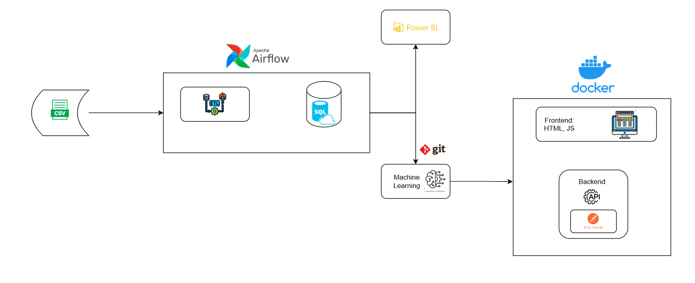
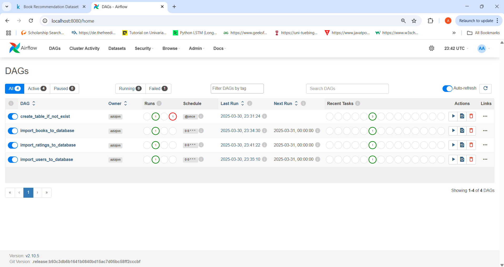
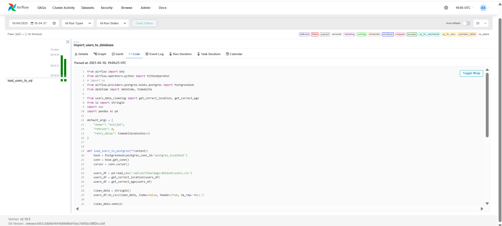
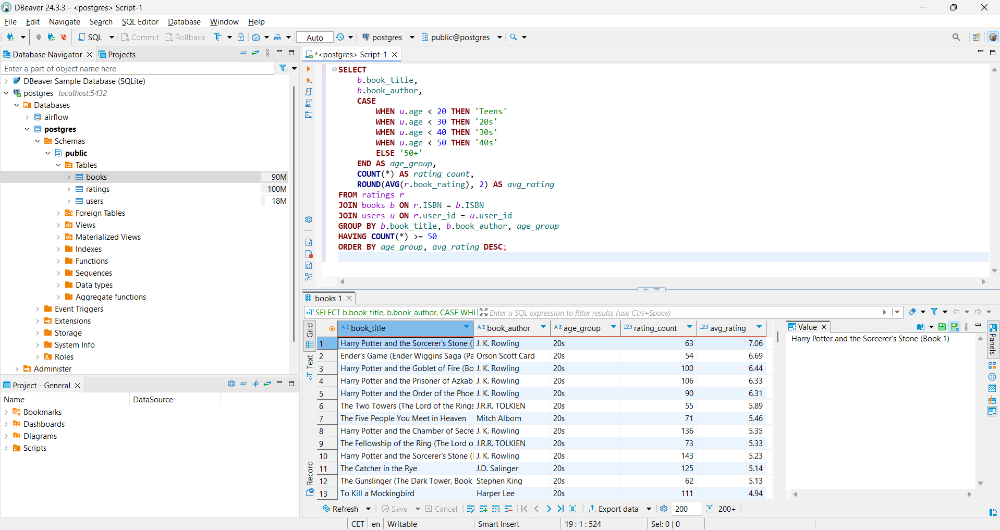
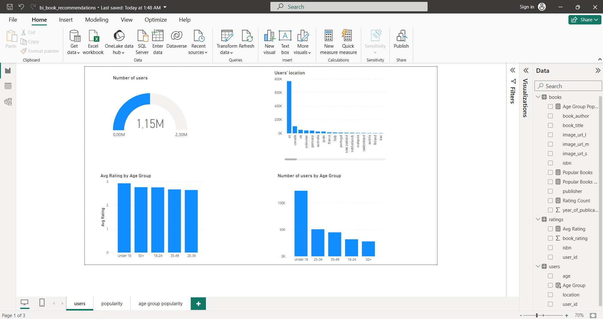
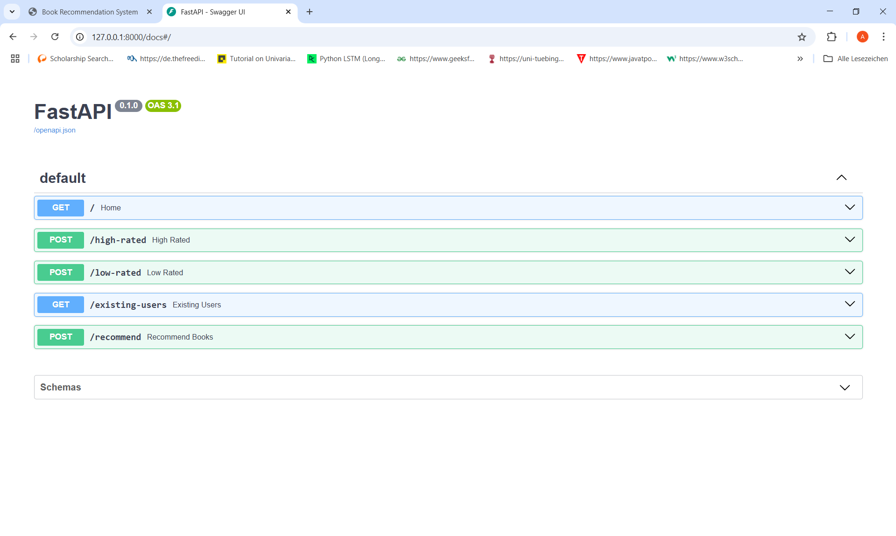

# Book Recommendation System

This is the full Data Engineering and Data Science project, which implements a book recommendation system using data from the [Book Recommendation Dataset on Kaggle](https://www.kaggle.com/datasets/arashnic/book-recommendation-dataset/data). The dataset contains three CSV files: `book.csv`, `ratings.csv`, and `user.csv`, which generate book recommendations.

### Project Structure Overview



```
! Due to the size restriction of the Github Repo, I am skipping the following files. Please download it yourself and replace them manually. For the sake of simplicity, I will create empty csv and pkl files, which are supposed to be replaced

### Must-Download Files 📌

dataset/Books.csv (must be replaced)
dataset/Ratings.csv (must be replaced)
dataset/Users.csv (optional)

### Auto-Generated Files - you just need to run recommendation.ipynb 📌
When executing `model/recommendation.ipynb`, the following files will be created automatically:

server/server_artifacts/book_metadata.pkl
server/server_artifacts/book_ratings.pkl
server/server_artifacts/high_rated.pkl
server/server_artifacts/low_rated.pkl
server/server_artifacts/user_sim_matrix.pkl ~ 4.2Gb

🚀 **Ensure you replace the required files before running the model!**

```


The system leverages cosine similarity to recommend books based on ratings and user preferences. It has both an API and a web interface for interacting with the recommendation system.

## Features
- **Data Cleaning & Processing**: Cleaned and preprocessed the dataset to ensure data quality.
- **ETL using Apache Airflow**: Automating ETL process.
- **Connecting to other Data&Business Analysis Tools**: Connecting Apache Airflow to PostSQL and PostSQL to PowerBI.
- **Cosine Similarity**: Utilized cosine similarity to generate book recommendations.
- **FastAPI Deployment**: The recommendation system was deployed using FastAPI.
- **Docker Support**: Created a Dockerfile for easy deployment.
- **Web Interface**: Built a simple web interface with HTML and JavaScript for interaction.

## Requirements
To run the application locally, you’ll need:
- Python 3.x
- Docker (for running in a container)
- Uvicorn for FastAPI
- ~4.5 Gb Memory for dataset and saving the models to run APIs

## Running the Application

You can run the recommendation system either manually or by using Docker. Below are the instructions for both methods:

### Method 1: Execution using Docker

1. **Initiate Apache Airflow**:

    ```bash
    docker compose up airflow-init
    docker compose up
    ```

2. **Connecting to external Analysis Tools**:

    Now you can go to the http://localhost:8080/home on your browser to access to Apache Airflow.
    You also need to connect Apache Airflow to SQL (any Relational SQL databases - in this case Dbeawer is used) and SQL to PowerBI. You can find how to connect it on the pdf file on the project -  [flowchart ↗️](flowchart.pdf)

3. **Build the Docker image**:

    ```bash
    docker build -t recommendation_books .
    docker run -p 8000:8000 recommendation_books
    ```

    This will expose the FastAPI app on `http://127.0.0.1:8000`.

4. **Access the application**:
    - **FastAPI Docs**: You can access the auto-generated documentation and interact with the API at `http://127.0.0.1:8000/docs`.
    - **Web interface**: Open `index.html` in your browser to use a more user-friendly interface for interacting with the recommendation system.

### Method 2: Manual execution using Uvicorn - on Machine Learning Part only

1. **Install dependencies**:

    If you haven't already, install the required Python packages by running:

    ```bash
    pip install -r requirements.txt
    ```

2. **Start the FastAPI app**:

    You can run the FastAPI app manually using Uvicorn by executing the following command:

    ```bash
    uvicorn server.server_api:app --reload
    ```

    This will start the FastAPI app on `http://127.0.0.1:8000`.

3. **Access the application**:
    - **FastAPI Docs**: Navigate to `http://127.0.0.1:8000/docs` to view and interact with the API documentation.
    - **Web interface**: Open `index.html` in your browser to access the user-friendly interface.

## Available API Functions

The API exposes four main functions, which are also accessible through the web interface:

1. **Low-Rated Books**: Get books with the lowest ratings from the dataset.
2. **High-Rated Books**: Get books with the highest ratings from the dataset.
3. **Existing User IDs**: Retrieve all the existing user IDs in the dataset.
4. **Book Recommendation for User ID**: Get book recommendations for a specific user based on their ratings and preferences.

### Example API Calls using Postman:

1. **Low Rated Books** (POST request):
   - URL: `http://127.0.0.1:8000/low-rated`
   - Parameters: `nums` (number of books to return)

2. **High Rated Books** (POST request):
   - URL: `http://127.0.0.1:8000/high-rated`
   - Parameters: `nums` (number of books to return)

3. **Existing User IDs** (GET request):
   - URL: `http://127.0.0.1:8000/existing-users`

4. **Book Recommendation for User ID** (POST request):
   - URL: `http://127.0.0.1:8000/recommend`
   - Parameters: `user_id` (ID of the user to get recommendations for), `nums` (number of recommendations)

## Project Structure

```bash
recommendation_books/
│
├── Dockerfile               
├── requirements.txt         
├── README.md
├── powerbi_book_recommendations.pdf
├── flowchart.pdf
├── model/
│──── airflow/
│   ├── recommendation.ipynb        
│   ├── docker-compose.yml
│────── dags/
│      ├── etl_books.py
│      ├── etl_users.py
│      ├── etl_ratings.py
│      ├── create_sql_tables.py
│      ├── users_data_cleaning.py
│──────── dataset/
│         ├── Books.csv
│         ├── Ratings.csv
│         ├── Users.csv        
│────── ../
├── server/
│   ├── server_api.py        
│   ├── server_utils.py
│   ├── index.html
│   ├── script.js
│──── server_artifacts
│      ├── book_metadata.pkl
│      ├── book_ratings.pkl
│      ├── high_rated.pkl
│      ├── low_rated.pkl
│      ├── user_sim_matrix.pkl   
├── temp/
│   ├── .. for README.md
│
```

## Project Screenshots

### Apache Airflow - ETL


### Apache Airflow - ETL Python Code


### SQL Server


### Power BI


### Web Interface


### Fast API Interface


### Postman Example 1 - Post Method


### Postman Example 2 - Get Method


